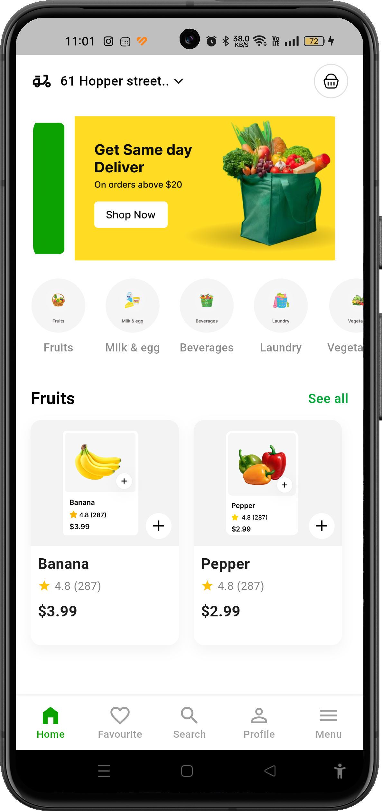

# Clean Home UI - Grocery App 🛒

A modern, responsive, and modular Grocery Shopping UI built with Flutter. This project demonstrates Clean Architecture principles and a scalable widget structure.

## 📱 Home Screen Preview

<p align="center">
  
</p>

## 🚀 Key Features

*   **Responsive UI**: Fully adapted for all screen sizes using `flutter_screenutil`.
*   **Modular Architecture**: Clean separation of concerns with reusable widgets.
*   **Feature Highlights**:
    *   **Custom AppBar**: Delivery location selector with interactive icons.
    *   **Promo Slider**: Smooth horizontal banner carousel for offers.
    *   **Categories**: Quick-access circular category section.
    *   **Product Showcase**: Elegant product cards with price, rating, and quick-add functionality.
    *   **Bottom Navigation**: Modern, styled navigation bar for seamless UX.

## 🏗️ Technical Stack

*   **Framework**: [Flutter](https://flutter.dev/)
*   **Layout & Scaling**: `flutter_screenutil`
*   **UI Components**: `carousel_slider`, Custom Modular Widgets.
*   **Architecture**: Clean Architecture (Presentation Layer).

## 📁 Project Structure

```text
lib/
├── core/              # Design system (Colors, Styles, Assets)
└── features/
    └── home/          # Home feature module
        └── presentation/
            ├── pages/    # Screen layouts
            └── widgets/  # Atomic/Modular components
```

---
*Developed with ❤️ focusing on Clean Code and UI/UX best practices.*
